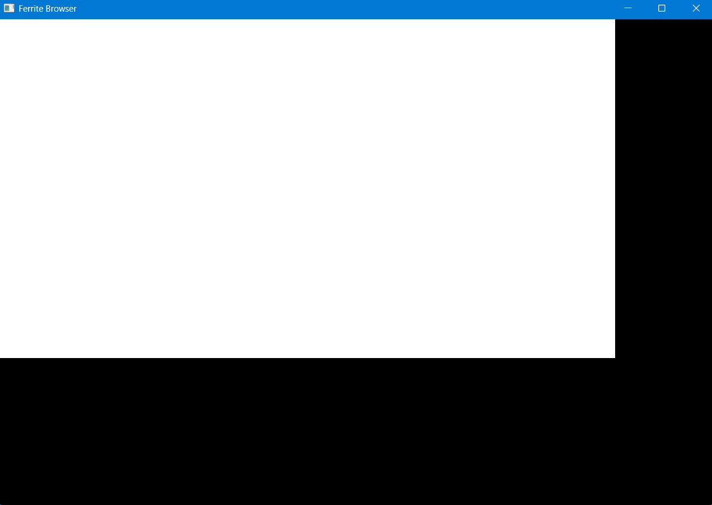

## Task 1: Servo shell
### Block 1: Add `ferrite-servo` crate + Servo dependency  |  ✅ Done
What it does: Creates the new crate and gets Servo compiling as a dependency. Nothing runs yet — just proves the build works with Servo in the tree.

Prompt for Claude Code:
```
Create a new library crate at crates/ferrite-servo in the Cargo workspace.
Add it to the workspace members in the root Cargo.toml.

In crates/ferrite-servo/Cargo.toml add:
[dependencies]
servo = { git = "https://github.com/servo/servo", tag = "v0.0.5" }
raw-window-handle = "0.6"
winit = "0.30"
log = "0.4"

In crates/ferrite-servo/src/lib.rs just add:
// Servo embedding crate — implementation follows in subsequent blocks
pub mod shell;

Create crates/ferrite-servo/src/shell.rs as an empty file with a comment:
// ServoShell implementation — see Block 2
```
Exit condition: `cargo build -p ferrite-servo` compiles successfully.

### Block 2: Window creation with winit  |  ✅ Done
What it does: Creates a native OS window using winit. No Servo yet — just a blank window that opens, stays open, and closes cleanly. Proves the windowing layer works on your machine before adding Servo on top.

Prompt for Claude Code:
```
In crates/ferrite-servo/src/shell.rs implement a ServoShell struct that:
- Has a new() -> Self constructor that creates a winit EventLoop and WindowBuilder with:
  title: "Ferrite Browser"
  inner_size: LogicalSize::new(1280, 800)
- Has a run(self) method that starts the winit event loop, handling:
  WindowEvent::CloseRequested → EventLoopControlFlow::Exit
  WindowEvent::RedrawRequested → window.request_redraw()
  Keep all other events as pass-through for now

In crates/ferrite-shell/src/main.rs add a second binary target or a feature flag so you can run the window separately from the smoke test. The simplest approach: move the smoke test into a fn run_smoke_test() and call either that or ServoShell::new().run() based on a CLI arg (first arg "window" → open window, anything else → smoke test).

Add ferrite-servo as a path dependency in ferrite-shell/Cargo.toml.
```
Exit condition: `cargo run --bin ferrite-shell window` opens a blank window titled "Ferrite Browser" and closes cleanly when you press the 'X' button.

### Block 3: Embed Servo, render a blank page  |  ✅ Done
What it does: Initialises Servo inside the window and loads about:blank. The window now has a live browser engine running in it, even though it shows nothing visible. This is the hardest block — Servo's embedding API has a specific initialisation sequence.

Prompt for Claude Code:
```
In crates/ferrite-servo/src/shell.rs extend ServoShell to embed Servo:

1. Add a servo field: Option<servo::Servo<ServoWindowCallbacks>>

2. Create a ServoWindowCallbacks struct implementing servo::WindowMethods with:
   - get_coordinates() returning a DeviceIntRect for the window size
   - set_animation_state() as a no-op for now
   - get_gl_context() — return a headless software GL context using servo's built-in offscreen rendering
   - get_native_widget() returning the raw window handle from winit

3. In ServoShell::new(), after creating the winit window:
   - Initialise servo::Servo with ServoWindowCallbacks
   - Call servo.handle_events(vec![]) once to let it start up
   - Load "about:blank" via servo.load_uri()

4. In the event loop, on RedrawRequested:
   - Call servo.handle_events(vec![]) to process pending events
   - Call servo.present() to render

Use servo v0.0.5 embedding API. If the exact method names differ from above, use the closest equivalents from the servo embedding crate's public API.
```
Exit condition: `cargo run -p ferrite-shell window` opens a window, Servo initialises without panicking (check terminal — no crash), and the window renders (even if blank/white).

### Block 4: Navigate to a real URL  |  ✅ Done
What it does: Points Servo at https://example.com and renders it. This is the Month 1 R1 milestone — "Servo renders a page".

Prompt for Claude Code:
```
In crates/ferrite-servo/src/shell.rs:

1. Change the initial load from "about:blank" to "https://example.com"

2. Add a LoadComplete callback to ServoWindowCallbacks so it logs when the page finishes loading:
   - Implement the load_ended() or navigation_complete() method (whichever exists in servo v0.0.5 WindowMethods)
   - Log: println!("[ferrite] page load complete: {}", url)

3. In the event loop, add handling for winit keyboard input:
   - If the user presses Escape → exit the event loop cleanly

4. Make sure servo.handle_events() is being called on every MainEventsCleared event (not just RedrawRequested) so Servo's internal event loop makes progress.
```
Exit condition: `cargo run -p ferrite-shell window` opens a window, loads https://example.com, and the page content is visible. Terminal prints the load complete message.

### Block 5: Wire the capability broker to Servo's network requests  |  ✅ Done
What it does: Intercepts outgoing network requests from Servo and routes them through `CapabilityBroker::check()` before allowing them. Denied requests are blocked. This is the first real integration of the broker with the engine.

Prompt for Claude Code:
```
In crates/ferrite-servo/src/shell.rs:

1. Add a CapabilityBroker field to ServoShell (import ferrite-capability-broker as a path dep in ferrite-servo/Cargo.toml)

2. On startup, mint a NetworkFetch token for origin "*" (wildcard) with a 3600s TTL — this is the "default allow" token that lets Servo load pages normally

3. Implement the resource_timing_listener or fetch_interceptor hook in ServoWindowCallbacks (whichever servo v0.0.5 exposes for intercepting network requests):
   - On each outgoing request URL, call broker.check(token_id, url)
   - If Granted → allow the request to proceed
   - If Denied → cancel the request and log: println!("[ferrite] BLOCKED: {} reason: {:?}", url, reason)

4. Add a test: after the page loads, call broker.revoke(token_id), then navigate to "https://example.com/test" — the request should be blocked and logged.

If servo v0.0.5 does not expose a fetch interceptor hook, implement this instead:
   - Override the resource_thread or net_traits::ResourceFetchTiming to wrap requests
   - Document in a code comment exactly which API was used and what is not yet hookable
```
Exit condition: Blocking the token stops network requests. Terminal shows `[ferrite] BLOCKED:` log lines when the token is revoked.

### Block 6: Log broker decisions to the audit log  |  ✅ Done
What it does: Every network request decision (grant or deny) is written to `PersistentAuditLog`. This closes the loop — Servo → broker → audit log — which is the core architecture working end-to-end for the first time.

Prompt for Claude Code:
```
In crates/ferrite-servo/src/shell.rs:

1. Add a PersistentAuditLog field to ServoShell (import ferrite-audit-log as a path dep in ferrite-servo/Cargo.toml)
   - Initialise at: std::env::temp_dir().join("ferrite_servo.db")

2. In the fetch interceptor from Block 5:
   - On Granted: call audit_log.append(AuditEventKind::CapabilityGranted, principal_id, Some("network.fetch"), Some(url))
   - On Denied: call audit_log.append(AuditEventKind::CapabilityDenied, principal_id, Some("network.fetch"), Some(url))

3. On Escape key press (clean exit), before the event loop exits:
   - Call audit_log.log.verify_chain()
   - If true: println!("[ferrite] audit chain verified: {} entries", audit_log.log.entries.len())
   - If false: println!("[ferrite] AUDIT CHAIN BROKEN — investigate immediately")

4. Print a summary on exit: how many grants, how many denials.
```
Exit condition: On exit, terminal shows the audit chain verified message with a non-zero entry count. The SQLite file exists at the temp path and contains rows.

## Task 2: Iced UI Shell
### Block 1: `ferrite-ui` crate, Iced hello-world with dark theme
What it does: Creates the ferrite-ui crate, gets Iced running with a dark theme window at the right size. Nothing functional yet — just proves Iced renders on your machine.

Prompt for Claude Code:
```
Create a new library crate at crates/ferrite-ui in the Cargo workspace.
Add it to workspace members in root Cargo.toml.

In crates/ferrite-ui/Cargo.toml add:
[dependencies]
iced = { version = "0.13", features = ["tokio"] }

Create crates/ferrite-ui/src/lib.rs with:
- A public FerriteBrowser struct implementing iced::Application
- Title: "Ferrite Browser"
- Window size: 1280 x 800
- Theme: iced::Theme::Dark
- Message enum: FerriteBrowserMessage (empty for now)
- view() returns a centered Text widget saying "Ferrite Browser — loading..."
- update() is a no-op match
- A pub fn launch() -> iced::Result that calls FerriteBrowser::run() with default settings

Add ferrite-ui as a path dependency in ferrite-shell/Cargo.toml.
In ferrite-shell/src/main.rs, add a CLI arg branch: if first arg is "ui" → call ferrite_ui::launch().
```
Exit condition: `cargo run -p ferrite-shell ui` opens a 1280x800 window titled "Ferrite Browser" with a dark theme and the text "Ferrite Browser — loading..." centered. The window closes cleanly when you press the 'X' button.

### Block 2: Tab bar component (add/close tabs, active tab highlights)
What it does: Adds a working tab bar at the top of the window. Tabs can be added and closed. The active tab is visually highlighted. No browser content behind it yet.

Prompt for Claude Code:
```
In crates/ferrite-ui/src/lib.rs extend FerriteBrowser with a tab bar:

1. Add to FerriteBrowserMessage:
   - AddTab
   - CloseTab(usize)
   - SelectTab(usize)

2. Add to FerriteBrowser state:
   - tabs: Vec<String>  (each String is the tab label, start with one tab: "New Tab")
   - active_tab: usize

3. Implement update() to handle all three messages:
   - AddTab → push "New Tab" to tabs, set active_tab to new index
   - CloseTab(i) → remove tabs[i], clamp active_tab to tabs.len().saturating_sub(1)
   - SelectTab(i) → set active_tab = i

4. Implement view() to show:
   - A top Row of tab buttons, each showing its label
   - The active tab button is visually distinct (different background or bold text)
   - Each tab has a small "×" button next to its label that sends CloseTab(i)
   - A "+" button at the end of the row that sends AddTab
   - Below the tab bar: a placeholder Text showing "Tab {active_tab} content"

Style with dark theme colours — tab bar background slightly lighter than window background.
```
Exit condition:
`cargo run -p ferrite-shell ui` shows a tab bar. Clicking "+" adds a tab. Clicking "×" removes it. Clicking a tab label selects it.

### Block 3: Address bar component (text input, URL submit on Enter)
What it does: Adds an address bar below the tab bar. The user can type a URL and press Enter. The URL is stored in state and displayed as the current tab's URL. No actual navigation yet — that wires up when Servo is integrated.

Prompt for Claude Code:
```
In crates/ferrite-ui/src/lib.rs extend FerriteBrowser with an address bar:

1. Add to FerriteBrowserMessage:
   - AddressBarChanged(String)
   - NavigateRequested(String)

2. Add to FerriteBrowser state:
   - address_bar_input: String  (the live text field content)
   - tab_urls: Vec<String>      (the committed URL per tab, default "about:blank")

3. Update update():
   - AddressBarChanged(s) → set address_bar_input = s
   - NavigateRequested(url) → set tab_urls[active_tab] = url, log: println!("[ferrite-ui] navigate requested: {}", url)

4. Update view() to show between the tab bar and content area:
   - A full-width TextInput widget bound to address_bar_input
   - Placeholder text: "Enter URL..."
   - on_input sends AddressBarChanged
   - on_submit sends NavigateRequested(address_bar_input.clone())
   - Below the address bar: Text showing "Current URL: {tab_urls[active_tab]}"

Keep all existing tab bar behaviour intact.
```
Exit condition:
`cargo run -p ferrite-shell ui` shows the tab bar and address bar. Typing a URL and pressing Enter updates the displayed current URL and prints the navigate log line.

## Task 3: Extism Extension Sandbox
### Block 1: `ferrite-sandbox` crate, Extism setup, Wasm module loading
What it does: Creates the ferrite-sandbox crate, adds Extism, and loads a pre-compiled Wasm module from disk. The module doesn't do anything meaningful yet — just proves Extism initialises and a .wasm file can be loaded.

Prompt for Claude Code:
```
Create a new library crate at crates/ferrite-sandbox in the Cargo workspace.
Add it to workspace members in root Cargo.toml.

In crates/ferrite-sandbox/Cargo.toml add:
[dependencies]
extism = "1"
thiserror = "1"
log = "0.4"

In crates/ferrite-sandbox/src/lib.rs implement:

1. SandboxError enum using thiserror:
   - LoadFailed(String)
   - CallFailed(String)
   - CapabilityDenied(String)

2. ExtensionSandbox struct with:
   - A new(wasm_path: &str) -> Result<Self, SandboxError> constructor that:
     - Reads the .wasm file from wasm_path
     - Creates an extism::Plugin from the bytes with no host functions yet
     - Stores it in the struct
   - A ping(&mut self) -> Result<String, SandboxError> method that:
     - Calls the Wasm export "ping" with no input
     - Returns the string output, or SandboxError::CallFailed if the export doesn't exist

3. Create a minimal test Wasm module as a Rust project at extensions/hello-ext/:
   - Cargo.toml: crate-type = ["cdylib"], no_std not required
   - src/lib.rs: export a "ping" function using extism_pdk that returns the string "pong"
   - Add a build script note: compile with: cargo build --target wasm32-unknown-unknown --release
     output will be at extensions/hello-ext/target/wasm32-unknown-unknown/release/hello_ext.wasm

Add ferrite-sandbox as a path dependency in ferrite-shell/Cargo.toml.
In ferrite-shell/src/main.rs add CLI arg "sandbox" → instantiate ExtensionSandbox with the hello-ext wasm path and call ping(), print the result.
```
Exit condition: After compiling `hello-ext` to Wasm and running `cargo run -p ferrite-shell sandbox`, terminal prints `pong`.

### Block 2: Host functions for `dom.read`, `network.fetch`, `storage.read`  |  ✅ Done
What it does: Defines host functions that Wasm extensions can call to request capabilities — host_dom_read, host_network_fetch, host_storage_read. Each host function checks with CapabilityBroker before doing anything. No real DOM or network access yet — host functions return stub data if granted, or an error string if denied.

Prompt for Claude Code:
```
In crates/ferrite-sandbox/src/lib.rs extend ExtensionSandbox with host functions:

1. Add ferrite-capability-broker as a path dependency in ferrite-sandbox/Cargo.toml

2. Add a CapabilityBroker field to ExtensionSandbox
   - Mint three tokens on construction (one per capability), all scoped to origin "*", 3600s TTL:
     - DomRead token
     - NetworkFetch token
     - StorageRead token
   - Store the token IDs alongside the broker

3. Define three host functions using extism's host function API:
   - host_dom_read(selector: &str) -> String
     Calls broker.check(dom_read_token, "*")
     If Granted → return "<div>stub DOM content for selector: {selector}</div>"
     If Denied → return "ERROR: dom.read denied"

   - host_network_fetch(url: &str) -> String
     Calls broker.check(network_fetch_token, url)
     If Granted → return "stub response body for: {url}"
     If Denied → return "ERROR: network.fetch denied"

   - host_storage_read(key: &str) -> String
     Calls broker.check(storage_read_token, "*")
     If Granted → return "stub value for key: {key}"
     If Denied → return "ERROR: storage.read denied"

4. Rebuild the extism::Plugin in new() to include all three host functions

5. Update extensions/hello-ext/src/lib.rs to export three new functions using extism_pdk:
   - test_dom_read: calls host_dom_read("h1") and returns the result
   - test_network_fetch: calls host_network_fetch("https://example.com/api") and returns the result
   - test_storage_read: calls host_storage_read("user_prefs") and returns the result
```
Exit condition: Running `cargo run -p ferrite-shell sandbox` calls all three test functions and prints the stub responses. Revoking a token before the call prints the denied error instead.

### Block 3: Demo extension: Wasm module that calls `host_dom_read` and receives a response  |  ✅ Done
What it does: Wires the sandbox to the audit log so every host function call — granted or denied — is recorded. Then runs a complete demo: extension loads, calls `host_dom_read`, gets stub DOM back, and the entire interaction is in the audit log with a verified chain. This is the Month 2 milestone.

Prompt for Claude Code:
```
In crates/ferrite-sandbox/src/lib.rs:

1. Add ferrite-audit-log as a path dependency in ferrite-sandbox/Cargo.toml

2. Add a PersistentAuditLog field to ExtensionSandbox
   - Initialise at std::env::temp_dir().join("ferrite_sandbox.db")

3. Update each host function to append to the audit log after the broker decision:
   - host_dom_read granted → AuditEventKind::CapabilityGranted, capability: "dom.read", url: selector
   - host_dom_read denied → AuditEventKind::CapabilityDenied, capability: "dom.read", url: selector
   - Same pattern for host_network_fetch and host_storage_read

4. Add a ExtensionSandbox::run_demo(&mut self) method that:
   - Calls the Wasm export "test_dom_read" → prints result
   - Calls the Wasm export "test_network_fetch" → prints result
   - Calls the Wasm export "test_storage_read" → prints result
   - Then revokes the DomRead token
   - Calls "test_dom_read" again → should print denied error
   - Calls audit_log.log.verify_chain() → assert true
   - Prints summary:
     "[ferrite-sandbox] demo complete — X audit entries, chain verified"

5. Update ferrite-shell/src/main.rs CLI arg "sandbox" to call run_demo() instead of ping()
```
Exit condition: `cargo run -p ferrite-shell sandbox` prints all three stub responses, then the denied error for the revoked token, then the audit summary with chain verified. This is the Month 2 R2 milestone — extension loads, executes, and receives capabilities.


## Task 4: Audit Log Viewer Panel
### Block 1: Audit log viewer panel in Iced  |  ✅ Done
What it does: Adds a DevTools-style panel inside the Iced UI that reads audit entries from the SQLite database and displays them in a scrollable table — principal, capability, URL, grant/deny, timestamp. Reads live from the DB so it reflects real sandbox and broker activity.

Prompt for Claude Code:
```
In crates/ferrite-ui/src/lib.rs extend FerriteBrowser with an audit log viewer panel:

1. Add ferrite-audit-log as a path dependency in crates/ferrite-ui/Cargo.toml

2. Add to FerriteBrowser state:
   - show_audit_panel: bool  (default false)
   - audit_entries: Vec<ferrite_audit_log::AuditEntry>  (default empty)

3. Add to FerriteBrowserMessage:
   - ToggleAuditPanel
   - RefreshAuditLog

4. Add to update():
   - ToggleAuditPanel → toggle show_audit_panel
   - RefreshAuditLog → attempt to load PersistentAuditLog from
     std::env::temp_dir().join("ferrite_sandbox.db"),
     if successful set audit_entries = log.entries cloned,
     if file doesn't exist yet set audit_entries = vec![]

5. In view(), add below the address bar:
   - A toolbar row with:
     - A "Audit Log" toggle button that sends ToggleAuditPanel
       (visually active/inactive based on show_audit_panel)
     - A "Refresh" button (only visible when show_audit_panel is true)
       that sends RefreshAuditLog

   - When show_audit_panel is true, render a scrollable table below the
     toolbar with columns:
     Seq | Timestamp | Kind | Principal | Capability | URL
     Each row maps to one AuditEntry.
     Kind should display as "GRANTED" (green text) or "DENIED" (red text)
     for CapabilityGranted/CapabilityDenied, and "EXERCISED"/"BLOCKED"
     for the others.
     Truncate long URLs to 40 chars with "..." suffix.
     Use a monospace-style small font (size 12) for table rows.
     When show_audit_panel is false, render the normal content area instead.

6. The audit panel height should be fixed at 250px, sitting above the
   main content area (not replacing it) — like a real DevTools drawer.
```
Exit condition: `cargo run -p ferrite-shell ui` shows the window. Clicking "Audit Log" opens the panel. Clicking "Refresh" after running the sandbox demo populates it with rows showing GRANTED and DENIED entries with correct colours.

## Task 5: Wire Servo WebView into the Iced UI
### Block 1: Embed Servo render surface inside Iced content area  |  ✅ Done
What it does: Replaces the "Tab N content" placeholder in the Iced UI with the actual Servo-rendered WebView. Servo renders into a texture/surface that Iced composites into the window.

Prompt for Claude Code:
```
In crates/ferrite-ui/src/lib.rs and crates/ferrite-servo/src/shell.rs:

1. Add ferrite-servo as a path dependency in crates/ferrite-ui/Cargo.toml

2. Add to FerriteBrowser state:
   - servo_shell: Option<ferrite_servo::shell::ServoShell>

3. Add to FerriteBrowserMessage:
   - ServoReady
   - ServoFrame  (emitted each time Servo has a new frame to display)

4. In FerriteBrowser::default(), initialise servo_shell as None.
   Add a subscription that initialises ServoShell on startup and emits
   ServoReady, then emits ServoFrame on each animation tick.

5. In view(), when servo_shell is Some:
   - Replace the "Tab N content" placeholder with an iced::widget::image
     or canvas widget that displays the latest frame rendered by Servo.
   - Servo renders to an offscreen buffer; read it as raw RGBA bytes and
     wrap in iced::widget::image::Handle::from_rgba().

6. Forward NavigateRequested(url) messages to ServoShell::navigate(url)
   so typing a URL in the address bar actually drives Servo.
```
Exit condition: `cargo run -p ferrite-shell ui` shows a real browser viewport. Typing https://example.com in the address bar and pressing Enter renders the page inside the Iced window.

### Block 2: Per-tab Servo sessions  |  ✅ Done
What it does: Each tab gets its own Servo browsing context. Opening a new tab creates a new session; closing a tab destroys it. Navigate commands go to the active tab's session only.

Prompt for Claude Code:
```
In crates/ferrite-ui/src/lib.rs:

1. Replace servo_shell: Option<ServoShell> with
   servo_sessions: HashMap<usize, ServoShell>
   where the key is the tab index.

2. On AddTab: create a new ServoShell for the new tab index,
   load "about:blank" in it.

3. On CloseTab(i): call servo_sessions.remove(&i), then re-key
   remaining sessions to reflect the new indices after removal.

4. On SelectTab(i): switch the active render source to servo_sessions[i].

5. On NavigateRequested(url): call servo_sessions[active_tab].navigate(url)

6. In view(): render the frame from servo_sessions[active_tab].
```
Exit condition: Opening two tabs and navigating each to a different URL shows independent pages. Closing one tab doesn't affect the other.

## Task 6: Containerization
### Prompt 1:
What it does: Creates a multi-stage Dockerfile. First stage installs all Servo build dependencies and pre-warms the Cargo registry by doing a dependency-only build. Second stage is the working image. Cargo's registry and compiled dependencies are cached in a Docker layer so subsequent builds only recompile changed code — not re-download crates.

```
Create .devcontainer/Dockerfile at the repo root
(C:\Users\Divit\OneDrive\Desktop\Major Project\.devcontainer\Dockerfile)
with this exact content:

FROM ubuntu:22.04

ENV DEBIAN_FRONTEND=noninteractive
ENV CARGO_HOME=/usr/local/cargo
ENV RUSTUP_HOME=/usr/local/rustup
ENV PATH=/usr/local/cargo/bin:$PATH

# ── System dependencies ────────────────────────────────────────────────────
# Servo requires: clang, lld, cmake, pkg-config, python3, gstreamer,
# libdbus, libfreetype, libfontconfig, libssl, libxcb + friends
RUN apt-get update && apt-get install -y --no-install-recommends \
    build-essential \
    curl \
    git \
    pkg-config \
    cmake \
    clang \
    lld \
    llvm \
    python3 \
    python3-pip \
    libssl-dev \
    libdbus-1-dev \
    libfreetype6-dev \
    libfontconfig1-dev \
    libglib2.0-dev \
    libgstreamer1.0-dev \
    libgstreamer-plugins-base1.0-dev \
    libgstreamer-plugins-bad1.0-dev \
    gstreamer1.0-plugins-base \
    gstreamer1.0-plugins-good \
    gstreamer1.0-plugins-bad \
    libxcb1-dev \
    libxcb-render0-dev \
    libxcb-shape0-dev \
    libxcb-xfixes0-dev \
    libx11-dev \
    libxext-dev \
    libxrandr-dev \
    libxi-dev \
    libxcursor-dev \
    sqlite3 \
    libsqlite3-dev \
    ca-certificates \
    && rm -rf /var/lib/apt/lists/*

# ── Rust toolchain ─────────────────────────────────────────────────────────
RUN curl --proto '=https' --tlsv1.2 -sSf https://sh.rustup.rs | \
    sh -s -- -y --default-toolchain stable --no-modify-path && \
    rustup target add wasm32-unknown-unknown && \
    rustup component add clippy rustfmt rust-analyzer

# ── Pre-warm Cargo registry ────────────────────────────────────────────────
# Copy only manifests first so this layer is cached unless deps change.
WORKDIR /build/Browser
COPY Browser/Cargo.toml ./Cargo.toml
COPY Browser/crates/ferrite-shell/Cargo.toml          ./crates/ferrite-shell/Cargo.toml
COPY Browser/crates/ferrite-capability-broker/Cargo.toml ./crates/ferrite-capability-broker/Cargo.toml
COPY Browser/crates/ferrite-audit-log/Cargo.toml      ./crates/ferrite-audit-log/Cargo.toml
COPY Browser/crates/ferrite-policy/Cargo.toml         ./crates/ferrite-policy/Cargo.toml
COPY Browser/crates/ferrite-servo/Cargo.toml          ./crates/ferrite-servo/Cargo.toml
COPY Browser/crates/ferrite-ui/Cargo.toml             ./crates/ferrite-ui/Cargo.toml
COPY Browser/crates/ferrite-sandbox/Cargo.toml        ./crates/ferrite-sandbox/Cargo.toml

# Create stub lib.rs / main.rs for each crate so `cargo fetch` resolves fully
RUN for dir in \
        ferrite-capability-broker \
        ferrite-audit-log \
        ferrite-policy \
        ferrite-servo \
        ferrite-ui \
        ferrite-sandbox; do \
    mkdir -p crates/$dir/src && \
    echo "// stub" > crates/$dir/src/lib.rs; \
    done && \
    mkdir -p crates/ferrite-shell/src && \
    echo "fn main(){}" > crates/ferrite-shell/src/main.rs

# Fetch all dependencies (populates CARGO_HOME registry cache)
RUN cargo fetch

# ── Working directory for actual development ───────────────────────────────
WORKDIR /workspace
```
Exit condition: `docker build -f .devcontainer/Dockerfile -t ferrite-dev .` from the `Major Project\` root completes without errors. The image exists locally.

### Prompt 2:
What it does: Creates `.devcontainer/devcontainer.json` so Antigravity detects the container automatically and offers to reopen inside it. Mounts the repo, sets the workspace, installs extensions, forwards port 9222 for the future agent WebSocket server.

```
Create .devcontainer/devcontainer.json at the repo root
(C:\Users\Divit\OneDrive\Desktop\Major Project\.devcontainer\devcontainer.json)
with this content:

{
  "name": "Ferrite Browser Dev",
  "build": {
    "dockerfile": "Dockerfile",
    "context": ".."
  },
  "workspaceFolder": "/workspace",
  "mounts": [
    "source=${localWorkspaceFolder},target=/workspace,type=bind,consistency=cached",
    "source=ferrite-cargo-cache,target=/usr/local/cargo/registry,type=volume",
    "source=ferrite-target-cache,target=/workspace/Browser/target,type=volume"
  ],
  "forwardPorts": [9222],
  "portsAttributes": {
    "9222": {
      "label": "Ferrite Agent WebSocket",
      "onAutoForward": "silent"
    }
  },
  "customizations": {
    "antigravity": {
      "extensions": [
        "rust-lang.rust-analyzer",
        "serayuzgur.crates",
        "tamasfe.even-better-toml",
        "vadimcn.vscode-lldb"
      ],
      "settings": {
        "rust-analyzer.cargo.buildScripts.enable": true,
        "rust-analyzer.checkOnSave.command": "clippy",
        "rust-analyzer.checkOnSave.extraArgs": ["--", "-D", "warnings"],
        "terminal.integrated.defaultProfile.linux": "bash"
      }
    },
    "vscode": {
      "extensions": [
        "rust-lang.rust-analyzer",
        "serayuzgur.crates",
        "tamasfe.even-better-toml",
        "vadimcn.vscode-lldb"
      ]
    }
  },
  "postCreateCommand": "cd /workspace/Browser && cargo fetch",
  "remoteUser": "root"
}

Also create .devcontainer/.dockerignore at the same path:
target/
.git/
*.pdf
*.pptx
*.html
```
Exit condition: Antigravity shows a "Reopen in Container" notification when the `Major Project` folder is opened. Accepting it builds and opens the container. `rustc --version` inside the container terminal prints stable Rust.

### Prompt 3:
What it does: Updates `.github/workflows/ci.yml` to install the same system dependencies as the Dockerfile so CI matches the local container environment exactly. Also adds the `wasm32-unknown-unknown` target and runs `cargo fetch` before building to use GitHub's cache effectively.

```
Replace the contents of .github/workflows/ci.yml with:

name: CI

on:
  push:
    branches: [main]
    paths:
      - 'Browser/**'
      - '.devcontainer/**'
      - '.github/workflows/ci.yml'
  pull_request:
    branches: [main]
    paths:
      - 'Browser/**'
      - '.devcontainer/**'
      - '.github/workflows/ci.yml'

defaults:
  run:
    working-directory: Browser

jobs:
  ci:
    name: Build, Lint & Test
    runs-on: ubuntu-22.04

    steps:
      - name: Checkout
        uses: actions/checkout@v4

      - name: Install system dependencies
        run: |
          sudo apt-get update && sudo apt-get install -y --no-install-recommends \
            pkg-config cmake clang lld llvm python3 \
            libssl-dev libdbus-1-dev libfreetype6-dev libfontconfig1-dev \
            libglib2.0-dev \
            libgstreamer1.0-dev libgstreamer-plugins-base1.0-dev \
            libgstreamer-plugins-bad1.0-dev \
            libxcb1-dev libxcb-render0-dev libxcb-shape0-dev \
            libxcb-xfixes0-dev libx11-dev \
            sqlite3 libsqlite3-dev
        working-directory: .

      - name: Install Rust stable
        uses: dtolnay/rust-toolchain@stable
        with:
          components: rustfmt, clippy
          targets: wasm32-unknown-unknown

      - name: Cache dependencies
        uses: Swatinem/rust-cache@v2
        with:
          workspaces: Browser

      - name: Fetch dependencies
        run: cargo fetch

      - name: Check formatting
        run: cargo fmt --check

      - name: Clippy (zero warnings)
        run: cargo clippy --workspace -- -D warnings

      - name: Run tests
        run: cargo test --workspace

      - name: Build hello-ext Wasm
        run: |
          cd ../extensions/hello-ext
          cargo build --target wasm32-unknown-unknown --release
        working-directory: Browser
```
Exit condition: Push to main. GitHub Actions runs green on the updated workflow including the Wasm build step.

## Task 7: UI Polish 1.0
### Block 1: Navigation controls + loading state
What it does: Adds back/forward/reload/stop buttons to the toolbar. Adds a loading indicator (animated progress bar under the address bar) that appears when a page is loading. Address bar updates to the actual loaded URL after navigation. Requires adding a message channel from `HeadlessServoSession` back to the Iced event loop for load status events.

Prompt for Claude Code:
```
In crates/ferrite-servo/src/session.rs:

1. Add a LoadStatus enum:
   pub enum LoadStatus { Loading, Complete, Failed(String) }

2. Add to HeadlessServoSession:
   - last_load_status: LoadStatus (default Loading)
   - current_url: String (default "about:blank")
   - pub fn load_status(&self) -> &LoadStatus
   - pub fn current_url(&self) -> &str

3. In HeadlessDelegate (WebViewDelegate impl):
   - Implement notify_load_status_changed (or equivalent in servo v0.0.5):
     LoadStatus::Complete → store in session, update current_url
     LoadStatus::Failed → store error string

4. In HeadlessServoSession::spin():
   - After servo event loop tick, update self.last_load_status from delegate

---

In crates/ferrite-ui/src/lib.rs:

1. Add to FerriteBrowser state:
   - is_loading: bool (default false)
   - can_go_back: bool (default false)
   - can_go_forward: bool (default false)

2. Add to FerriteBrowserMessage:
   - GoBack
   - GoForward
   - Reload
   - StopLoading
   - LoadStatusChanged { tab: usize, status: String, url: String }

3. Add to update():
   - GoBack → call session.go_back() if exists, set is_loading = true
   - GoForward → call session.go_forward() if exists, set is_loading = true
   - Reload → call session.reload() if exists, set is_loading = true
   - StopLoading → call session.stop() if exists, set is_loading = false
   - LoadStatusChanged → update is_loading, update address_bar_input and
     tab_urls[tab] to the new url if different from what was typed
   - NavigateRequested → set is_loading = true (immediately on submit)

4. In the ServoFrame tick in update(), after spin():
   - Read session.load_status() and send LoadStatusChanged if it changed
   - Read session.can_go_back() and session.can_go_forward() and update state

5. In view(), replace the current address bar row with a proper toolbar:
   
   Row layout (left to right):
   [←] [→] [⟳/✕]   [🔒 https://... address bar (fills width) ]
   
   - Back button (←): sends GoBack, disabled (greyed) when can_go_back = false
   - Forward button (→): sends GoForward, disabled when can_go_forward = false
   - Reload/Stop button: shows ⟳ when not loading (sends Reload),
     shows ✕ when is_loading = true (sends StopLoading)
   - Address bar: full width text_input as before
   - Show a lock icon (🔒) prefix in the address bar when url starts with https://
   
   Below the toolbar, when is_loading = true:
   - A thin (3px) progress bar spanning full width using primary accent colour
   - Animate it as a moving stripe (indeterminate) using iced subscription tick
   - Hide it completely when is_loading = false
```
Exit condition: `cargo run -p ferrite-shell ui` shows the toolbar with back/forward/reload buttons. The progress bar appears when navigating and disappears when the page loads. The address bar updates to the final URL after navigation.

### Block 2: Visual chrome overhaul
What it does: Redesigns the overall visual layout to look like a real browser. Consistent spacing, proper colour hierarchy, improved tab design, tighter typography. No functional changes — purely visual.

Prompt for Claude Code:
```
In crates/ferrite-ui/src/lib.rs, apply the following visual changes:

LAYOUT CONSTANTS (define as const at top of file):
  TOOLBAR_HEIGHT: f32 = 44.0
  TAB_BAR_HEIGHT: f32 = 36.0
  TAB_MIN_WIDTH: f32 = 120.0
  TAB_MAX_WIDTH: f32 = 240.0
  BORDER_RADIUS: f32 = 6.0
  PANEL_PADDING: u16 = 8

COLOUR PALETTE (derive from iced Theme::Dark extended palette):
  - Window background: palette.background.base.color (darkest)
  - Tab bar background: palette.background.weak.color (slightly lighter)
  - Toolbar background: palette.background.base.color (same as window)
  - Active tab: palette.primary.base.color with 0.15 alpha overlay
  - Address bar background: palette.background.strong.color
  - Text primary: palette.background.base.text
  - Text secondary: Color { a: 0.6, ..palette.background.base.text }
  - Accent: palette.primary.strong.color
  - Danger: palette.danger.base.color

TAB BAR changes:
  - Fixed height TAB_BAR_HEIGHT
  - Each tab is a rounded rectangle (BORDER_RADIUS) with horizontal padding 12px
  - Tab label text: size 13, truncated to TAB_MAX_WIDTH
  - Active tab has a 2px bottom border in accent colour
  - Inactive tabs have no border, hover shows background.strong
  - Close (×) button is 16x16, only visible on hover of that tab
  - "+" button is square, 36x36, at right end of tab strip
  - Tab strip scrolls horizontally if tabs overflow (use iced Scrollable horizontal)

TOOLBAR changes:
  - Fixed height TOOLBAR_HEIGHT
  - Back/Forward buttons: 32x32 rounded squares, icon text size 16
  - Reload/Stop button: 32x32 rounded square
  - 8px gap between navigation buttons and address bar
  - Address bar: height 32px, border radius 16px (pill shape),
    background address bar colour, 10px horizontal padding inside
    font size 13, monospace-ish (use default but size 13)
  - Lock icon left of URL text, colour: green if https, grey if http/other
  - 8px padding on each side of toolbar

GENERAL:
  - 1px separator line between tab bar and toolbar (use palette.background.strong)
  - 1px separator line between toolbar and viewport
  - Audit panel drawer: rounded top corners, subtle shadow effect via border
  - All button text size: 14
  - Consistent 4px spacing between all toolbar elements
```
Exit condition: `cargo run -p ferrite-shell ui` looks like a real browser. Tab bar is visually distinct from toolbar. Address bar is pill-shaped. Navigation buttons are clearly interactive. Overall impression is a polished dark-theme developer browser.

### Block 3: Keyboard shortcuts + smart URL handling
What it does: Adds the keyboard shortcuts developers expect, and makes the address bar smart — auto-prepends `https://`, and falls back to DuckDuckGo Lite search for non-URL input.

Prompt for Claude Code:
```
In crates/ferrite-ui/src/lib.rs:

1. Add keyboard shortcut handling via iced::keyboard::on_key_press subscription.
   Merge it with the existing ServoFrame subscription using Subscription::batch.

   Shortcuts:
   Ctrl+T → AddTab
   Ctrl+W → CloseTab(active_tab)
   Ctrl+R or F5 → Reload
   Ctrl+L → FocusAddressBar (new message, see below)
   Alt+Left → GoBack
   Alt+Right → GoForward
   Escape → StopLoading (if is_loading), else ClearAddressBarFocus

2. Add to FerriteBrowserMessage:
   - FocusAddressBar  (selects all text in address bar, focuses it)
   - ClearAddressBarFocus

3. Add to update():
   - FocusAddressBar → set a focused: bool = true flag on state, return
     Task::widget(text_input::focus(ADDRESS_BAR_ID)) using iced text_input Id
   - ClearAddressBarFocus → focused = false

4. Give the address bar text_input a static Id:
   const ADDRESS_BAR_ID: &str = "ferrite_address_bar";
   Use text_input::Id::new(ADDRESS_BAR_ID) in view()

5. Smart URL handling — update the NavigateRequested handler in update():

   fn resolve_url(input: &str) -> String {
     let trimmed = input.trim();
     // Already has a scheme
     if trimmed.starts_with("http://") || trimmed.starts_with("https://") {
       return trimmed.to_string();
     }
     // Looks like a domain (contains a dot, no spaces)
     if !trimmed.contains(' ') && trimmed.contains('.') {
       return format!("https://{}", trimmed);
     }
     // Treat as search query
     let encoded = url_encode(trimmed); // use percent-encoding or urlencoding crate
     format!("https://lite.duckduckgo.com/lite/?q={}", encoded)
   }

   Add urlencoding = "2" to ferrite-ui/Cargo.toml.
   Call resolve_url on the input before passing to session.navigate().
   Update address_bar_input and tab_urls with the resolved URL.
```
Exit condition: `cargo run -p ferrite-shell ui`. Press `Ctrl+T` — new tab opens. Press `Ctrl+L` — address bar focuses. Type `rust-lang.org` — navigates to `https://rust-lang.org`. Type `what is ownership in rust` — navigates to DuckDuckGo Lite search results.

### Block 4: Error states + new tab page
What it does: Handles navigation failures gracefully with an error page. Replaces the blank `about:blank` with a styled new-tab page. Updates tab titles from the actual page title. Adds a favicon placeholder.

Prompt for Claude Code:
```
In crates/ferrite-ui/src/lib.rs:

1. ERROR PAGE
   When LoadStatusChanged arrives with status = "Failed":
   - Set a new state field: tab_error: Vec<Option<String>> (parallel to tabs)
     containing the error message for that tab, or None if no error
   - In view() content area: if tab_error[active_tab] is Some(msg), render
     an error page instead of the servo frame:
     
     Centred column containing:
     - Large "⚠" icon (text, size 48, colour danger)
     - Text "Could not load page" (size 20, bold)
     - Text showing the failed URL (size 13, secondary colour, monospace)
     - Text showing the error message (size 12, secondary colour)
     - Button "Try Again" that sends Reload
     - Button "Go Home" that sends NavigateRequested("https://lite.duckduckgo.com")
     
     Style: centred in the content area, comfortable vertical spacing

2. NEW TAB PAGE
   When the active tab's URL is "about:blank" and no error, render instead
   of the servo frame:
   
   Centred column containing:
   - Text "ferrite" (size 48, bold, accent colour)
   - Text "capability-governed browser" (size 14, secondary colour)
   - 32px vertical space
   - A large text_input (width 480px, height 44px, pill-shaped border radius 22px)
     placeholder: "Search or enter address"
     on_submit → NavigateRequested (with smart URL resolution from UI-P3)
     separate state field: new_tab_search_input: String
   - 16px vertical space
   - Row of quick-access link buttons (sends NavigateRequested on press):
     "DuckDuckGo" → https://lite.duckduckgo.com
     "Rust Docs" → https://doc.rust-lang.org
     "Servo" → https://servo.org
   
   Style: dark background matching window, accent colour for the logo

3. TAB TITLES
   Add tab_titles: Vec<String> to state (parallel to tabs, default "New Tab")
   In LoadStatusChanged handler: update tab_titles[tab] with the page title
   if available from session.page_title() (add page_title() to HeadlessServoSession
   returning Option<String> from the WebViewDelegate title callback)
   In view() tab bar: use tab_titles[i] instead of tabs[i] for display

4. FAVICON PLACEHOLDER
   Add a small "🌐" text (size 12) to the left of each tab label.
   When a tab is loading, show a "⟳" instead.
   (Real favicons from Servo come later — this is just the placeholder)
```
Exit condition: `cargo run -p ferrite-shell ui`. New tab shows the Ferrite home page with working search bar. Navigating to an invalid URL shows the error page with Try Again button. Tab labels update to page titles after loading. Tabs show globe or spinner icon.